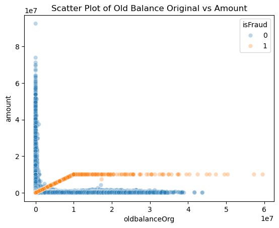
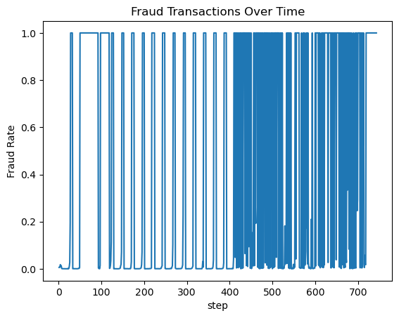

# Read Me File

##About: 
This a Financial Fraud Dataset. Within this project, we will take a look at a synthetic dataset of bank transactions to see which strategies we can take in order to successfully capture as many fraudulent transactions as possible, while also minimizing false positives. 

##Key Insights from the Exploratory Data Analysis 🔑: 

1. Fraud is concentrated in two transaction types. Analysis of fraud rate by transaction type revealed that CASH_OUT and TRANSFER are the main transaction types associated with fraud. 

2. Account balance wipeout is the strongest fraud signal. Scatter plots of oldbalanceOrg vs. amount & newbalanceOrg vs amount show a tight cluster of fraud cases where the transaction amount equals the entire original balance — effectively draining accounts to zero. This pattern held regardless of transaction size, supporting the core hypothesis: if an account is wiped to zero, it is likely fraud.

3. newbalanceDest and oldbalanceDest are highly correlated.
The correlation heatmap revealed high collinearity between these two destination balance columns, meaning one is largely redundant for modeling purposes.

4. step (time) is not a reliable fraud predictor.
A line plot of fraud rate over time showed irregular spikes with no consistent temporal pattern. Fraud does not cluster at specific time steps, making this feature a poor predictor. Step time will be a feature that is dropped as it is not signifcant for indicating any patterns in fraud rates.

##Feature Engineering 🛠️:

Feature Created
BalanceDiff = newbalanceOrig − oldbalanceOrg
This engineered feature directly captures the balance change in the origin account. A large negative value indicates the account was drained, which EDA identified as the strongest fraud pattern. It consolidates two correlated columns into one meaningful signal.

Feature Selected 
amount, oldbalanceDest, newbalanceDest, isFlaggedFraud (dropped later), and one-hot encoded type columns 

Handling Outliers
Outliers were intentionally retained. Banking datasets naturally contain high-value accounts alongside low-balance accounts — removing outliers would discard legitimate variation. Random Forest was chosen partly for its robustness to outliers.

##Model 👩🏾‍💻🏦: 

RandomizedSearchCV was chosen over GridSearchCV because of the large datset size. GridSearchCV exhaustively tests every combination of hyperparameters, which would be computationally prohibitive at this scale.

The model’s performance improved slightly after discovering the optimal hyperparameters. The number of False Negatives reduced by 2 transactions. It went from 470 with the baseline model and 468 with the hyperparameter tuning. The baseline F1 score was 79 and the final hyperparameter tuning score was 82. 
